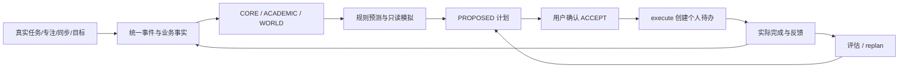

# 六层世界模型：后端完成情况与接口接入

核对日期：2026-10-03。依据[六层世界模型规划](../项目规划书/六层世界模型.md)、当前后端实现及自动化测试。本文面向后端负责人和客户端联调；完整字段表见[学习状态与计划接口](api/11-learner.md)、[字段字典](api/schemas.md)与[OpenAPI JSON](api/openapi.json)。

## 当前结论

按“前端只调用 HTTP 接口写入和读取”的标准，**任务、专注、目标、计划与反馈的主业务链路已经闭环**：写入事实 → 读取状态/预测 → 模拟 → 生成并确认计划 → 执行获得待办 ID → 实际完成并反馈 → 读取新状态/预测 → 重新规划。该链路已由只使用公开 HTTP 业务接口的验收测试覆盖，前端无需调用内部服务、访问数据库或自行生成学习事件。

六层都有确定性规则基线，但所有规划分支尚未完整接通。用户偏好缺少真实写入入口，WORLD/ACADEMIC 纠正不被当前请求模型接受，WORLD 逐项证据仍未接线；真实课表冲突和预测校准也有缺口。**主业务接口闭环成立，不代表六层规划的每个功能均已完成。**

| 层 | 已实现能力 | 完成情况与边界 | 主要实现 |
| --- | --- | --- | --- |
| 1 事件 | 统一事件模型、来源与事件组合校验、幂等入库；专注结束、任务完成、学习通/教务同步、目标与反馈等业务接线 | 业务事件链路已具备；部分扩展事件只有服务方法，存在方法不代表每个客户端都有入口 | [learner_event_service.py](../backend/app/services/learner_event_service.py)、[learner_event.py](../backend/app/schemas/learner_event.py) |
| 2 状态 | CORE、ACADEMIC、WORLD 三类投影、历史运行、状态变化；WORLD 八类状态均可返回 | 基础投影已具备；日程冲突和偏好仍是有限规则，详见剩余工作 | [learner_state_service.py](../backend/app/services/learner_state_service.py)、[learner_state.py](../backend/app/api/routes/learner_state.py) |
| 3 不确定性与证据 | 置信度、数据质量、观察窗口、有效期、版本、输入摘要；CORE/ACADEMIC 证据查询 | 元信息接口已具备；WORLD 当前未挂接逐项证据，证据列表可能为空，不能把所有判断都描述为可追溯 | [learner_state.py](../backend/app/schemas/learner_state.py)、[learner_state_repository.py](../backend/app/repositories/learner_state_repository.py) |
| 4 预测 | 五类规则估计器、解释码、证据计数、质量降级；离线 Brier/ECE 等指标框架 | 已实现规则预测；没有真实结果校准，概率不是经真实学生数据验证的成功率 | [forecast_service.py](../backend/app/services/forecast_service.py)、[forecast_calibration.py](../backend/app/services/forecast_calibration.py) |
| 5 反事实模拟 | 六类干预白名单；内存比较预测与状态；有效期、局限性和非因果声明 | 已实现只读基线；部分状态变化只是有限规则或模拟标记，调整目标日期不保证预测趋势改变 | [simulation_service.py](../backend/app/services/simulation_service.py)、[simulation.py](../backend/app/schemas/simulation.py) |
| 6 行动闭环 | 生成、接受/拒绝、事务执行、幂等重试、撤销、反馈、评估、阶段总结、重新规划；采纳后进入自适应干预 | 主 HTTP 流程已验证；执行响应直接返回新待办 ID。EXECUTED 只表示计划任务创建成功，实际学习完成另行记录 | [learning_planner_service.py](../backend/app/services/learning_planner_service.py)、[learning_plans.py](../backend/app/api/routes/learning_plans.py) |

## 本次修复

- `/learner-state/academic` 使用真实分页总数，正确返回 `has_more`；补齐版本、输入摘要、`as_of`、告警与证据数量。
- `/learner-state/runs` 和 `/learner-state/changes` 新增可选 `projection_kind`，支持 CORE、ACADEMIC、WORLD；不传时仍默认 CORE。
- 普通计划接入真实 `ForecastService.get_forecast()`；高工作负载会进入任务解释，服务异常时返回 `forecast_unavailable` 并保持可降级。
- 模拟不再写入 CORE 投影、快照和证据；无幂等键请求在事实变化后重新计算，显式幂等重试按有效期重放。
- 接受计划的模拟缓存考虑计划状态和条目，有效期不超过可模拟计划的有效期。
- 增加未来专注时间在预测窗口内的风险估计；降低负载模拟保留课程关联与重要性，避免移动课程任务和重要个人任务。
- 调整目标日期时，模拟前后的目标预测使用同一个目标；相同的不可用预测不再被错误报告为变化。
- 课程工作负载/冲突预测仅纳入明确归属该课程的任务和记录；无法映射的教务记录排除并降级，不能把其他课程计入指定课程。
- 计划条目新增可空 `execution_task_id`，从现有执行记录读取，不改数据库结构。执行、详情和列表均返回同一新待办 ID；重试保持稳定，撤销后保留历史关联。
- 任务响应正确返回已有的 `source/external_id/course_id/source_url/last_synced_at` 字段，前端可以识别计划生成的待办。
- 状态、预测、模拟和规划读取保留时刻的微秒，修复同一秒内刚结束的专注会话被遗漏的问题；规划的小时缓存桶仍清除微秒，避免相同事实的生成重试出现幂等冲突。
- 计划采纳与干预观测使用同样的时间精度，保证采纳时引用的基线运行已保存，后续自动评估可以读取真实的前后状态。

预测、模拟与规划器版本分别更新为 `forecast-baseline-v2`、`simulation-baseline-v2`、`campus-companion-plan-v2`。旧版本计划执行会按既有版本校验返回 `LEARNING_PLAN_STALE`，应重新规划。

## 接入约定

- 所有路径使用 `/api/v1` 前缀；普通成功响应直接返回 JSON 对象，不套 `data` 信封。
- 请求头使用 `Authorization: Bearer <access_token>`。状态、预测、模拟、计划、控制与干预接口限本人学生身份；`student-goals` 当前允许已登录用户操作自己的目标。
- 用户归属从 JWT 解析。客户端不要传 `user_id`；不能用另一个学生的目标、计划、快照或运行 ID。
- 事件由业务接口和同步服务产生，当前没有对外的任意事件写入 HTTP 接口。客户端应提交真实任务、会话、目标和进度，不应伪造学习事件。
- 日期时间推荐带时区的 ISO 8601，例如 `2026-10-10T20:00:00+08:00`。模拟时间参数与计划窗口会验证时区；不同业务接口的校验强度以字段字典为准。
- 分页一般为 `page >= 1`、`1 <= page_size <= 100`，返回 `items/total/page/page_size/has_more`；目标列表上限是 200。状态变化列表使用 `changes` 字段。
- 常规状态查询会计算并可能保存新的实际状态投影；模拟接口只在内存计算，不保存状态或执行业务动作。

### 数据质量与展示

`data_quality` 使用小写枚举：`verified`、`partial`、`stale`、`unavailable`。`data_source_health.value.status` 才使用 `FRESH/PARTIAL/STALE/UNAVAILABLE`。不要将规划书中的大写示意直接作为所有字段的枚举。

| 数据质量 | 客户端解释 |
| --- | --- |
| `verified` | 当前规则获得了所需观测；不能解释为已证明因果效果或已获得所有校园数据 |
| `partial` | 数据或来源不完整，展示告警和判断依据 |
| `stale` | 数据已陈旧，提示同步或刷新；不要作为实时事实 |
| `unavailable` | 数据不足，明确显示“暂无足够数据”；预测概率为 null、置信度为 0 |

返回数值为 0 或压力等级为 LOW 时，先检查 `data_quality`。未知数据的默认数值不代表学生确实没有任务、没有压力或没有日程冲突。`valid_until` 到期应重新查询；证据为空时明确展示“暂无可追溯证据”。

## 事件输入与目标

| 业务 | 入口 | 后端行为 |
| --- | --- | --- |
| 创建/完成任务 | `POST /tasks`、`POST /tasks/{task_id}/complete` | 保存真实业务记录；完成动作记录学习事件，状态也读取权威任务记录 |
| 专注会话 | `POST /study/sessions`、`POST /study/sessions/{session_id}/finish` | 保存开始/结束与结构化观测，结束后记录事件 |
| 外部数据 | `/chaoxing/*`、`/edu/*` | 用户连接与同步成功后产生对应观测；无真实账号的测试不等于学校接入已验收 |
| 创建/查询目标 | `POST /student-goals`、`GET /student-goals`、`GET /student-goals/{goal_id}` | 目标按用户隔离，创建可选幂等键 |
| 更新/归档目标 | `PATCH /student-goals/{goal_id}`、`POST /student-goals/{goal_id}/archive` | 更新业务事实并记录目标变化事件 |
| 报告进度 | `POST /student-goals/{goal_id}/progress` | 更新 0～100 的进度，可选里程碑及幂等键；已归档目标不能继续报告 |

以上表格的路径均需加 `/api/v1`。目标类别：`academic/research/competition/certificate/job_search/internship/campus_affair/health_habit/personal_growth`。

创建目标请求示例：

```json
{
  "name": "准备奖学金申请材料",
  "category": "campus_affair",
  "target_date": "2026-10-10T20:00:00+08:00",
  "initial_progress_percent": 0,
  "milestone_count": 3,
  "idempotency_key": "goal-scholarship-example-1"
}
```

响应为 `{ "goal": StudentGoalOut, "created": boolean }`。示意中的类型名不是实际 JSON；后续使用响应中的 `goal.goal_id`。

## 状态、运行与证据

| 方法与路径 | 参数与用途 | 响应模型 |
| --- | --- | --- |
| `GET /learner-state/snapshots` | `projection_kind=CORE/ACADEMIC/WORLD`，默认 CORE；可选 `state_type/scope_type/course_id/page/page_size`；`projection_scope` 只允许 `__user__` | `LearnerStateSnapshotPage` |
| `GET /learner-state/academic` | ACADEMIC 快捷入口，`page/page_size`；与通用状态接口使用一致的分页和元信息 | `LearnerStateSnapshotPage` |
| `GET /learner-state/runs` | `projection_kind` 默认 CORE；`page/page_size`；返回该类投影的运行历史 | `LearnerStateRunPage` |
| `GET /learner-state/changes` | `projection_kind` 默认 CORE；可选 `from_run_id/to_run_id/scope_type/state_type/include_unchanged/page/page_size` | `LearnerStateChangePage` |
| `GET /learner-state/snapshots/{snapshot_id}/evidence` | `page/page_size`；快照与证据归属本人；自动识别投影类型 | `LearnerStateEvidencePage` |

`changes` 未传 `to_run_id` 时，计算 `projection_kind` 指定类型的当前状态；显式传 `to_run_id` 时以该运行的实际类型为准。未传 `from_run_id` 时选择同一类型、同一估计器版本的上一个运行；首次运行报告 ADDED。显式跨类型/跨用户比较返回 404。显式比较不同估计器版本时 `estimator_changed=true`，不输出数值变化结论。

| 投影 | 状态类型 |
| --- | --- |
| CORE | `observed_learning_activity`、`task_workload`、`deadline_exposure`、`course_participation`、`data_source_health` |
| ACADEMIC | `academic_course_load`、`grade_observation`、`knowledge_mastery_observation`、`credit_progress`、`exam_exposure`、`schedule_load`、`goal_state` |
| WORLD | `workload_pressure`、`schedule_conflict`、`academic_progress`、`focus_rhythm`、`goal_progress`、`execution_consistency`、`growth_momentum`、`preference_profile` |

每个快照包含 `snapshot_id/run_id/projection_kind/projection_scope/state_type/value/confidence/data_quality/observed_from/observed_through/valid_until/computed_at/estimator_version/input_digest/as_of/warning_codes/evidence_count` 及所属 scope。`value` 的结构随 `state_type` 变化，不要按单一对象解析。

证据返回受限摘要：`evidence_kind/source_category/event_id/event_type/occurred_at/data_quality/role/explanation_code`。不会返回原文、内部表名或业务行 ID；当前该接口不提供任意原文详情跳转。WORLD 的证据数量目前可能始终为 0，属于待完善项。

## 预测

`GET /api/v1/learner-state/forecasts`，返回 `ForecastPage`。

| 参数 | 约束与语义 |
| --- | --- |
| `forecast_type` | 可空；未传则返回下面五类预测 |
| `horizon_days` | 默认 7，范围 1～30 |
| `goal_id` | 仅目标趋势预测按该目标筛选；不传为全用户目标概况 |
| `course_id` | 工作负载/日程冲突预测按明确课程关联筛选；教务 course_code 尚未映射到本站 course_id，未知归属排除并降级；其他预测类型仍为 USER 范围 |
| `page/page_size` | 默认 1/20，每页上限 100 |

五类预测为 `DEADLINE_COMPLETION_RISK`、`UPCOMING_WORKLOAD`、`SCHEDULE_CONFLICT_RISK`、`GOAL_PROGRESS_OUTLOOK`、`ROUTINE_CONTINUITY`。

每项包含 `forecast_id/forecast_type/scope_type/scope_id/horizon_start/horizon_end/probability/value/confidence/data_quality/estimator_version/input_digest/as_of/valid_until/explanation_codes/evidence_summary/limitations`。`evidence_summary` 为观测数量，不是逐条事实引用；`probability` 必须结合类型和规则含义解释，不能统一显示成“任务完成率”。

规则示例：未来工作负载按任务数量与考试数量估计分钟数；专注节律使用已结束会话间隔；目标趋势使用当前进度与最近更新时间。目标趋势估计器尚未使用目标截止日期，因此延长日期时趋势可能保持不变。置信度为规则映射，不是训练模型的校准概率。

## 反事实模拟

`POST /api/v1/learner-state/simulations`，返回 `SimulationResponse`。

```json
{
  "intervention": {
    "intervention_type": "ALLOCATE_FOCUS_MINUTES",
    "focus_minutes": 30
  },
  "horizon_days": 7
}
```

| `intervention_type` | 必填字段 | 其他字段/限制 |
| --- | --- | --- |
| `ALLOCATE_FOCUS_MINUTES` | `focus_minutes`，0～480 | 可选带时区 `target_date`；当前时间到预测窗口末端内的增量进入截止风险估计；未来会话不会被计作已经结束的节律观测 |
| `RESCHEDULE_TASK` | `task_id`、带时区 `new_deadline` | 只修改内存中的对应任务，不写真实截止时间 |
| `ACCEPT_PLAN` | `plan_id` | 计划须归属本人；不存在为 404，不可模拟/过期状态返回对应 limitations；只模拟接受，不执行 |
| `REDUCE_DAILY_LOAD` | `reduce_minutes_per_day`，0～480 | 可选 `target_date`；`movable_task_policy` 固定 PERSONAL_ONLY；当前规则只移动无课程关联且非重要的个人任务，尚未精确按 target_date 分配每天负载 |
| `PAUSE_DATA_SOURCE` | `source_category` | `academic/chaoxing/notice/study_session/manual`；只模拟部分输入过滤，不调用真实数据源开关 |
| `ADJUST_GOAL_DEADLINE` | `goal_id`、带时区 `new_target_date` | 前后目标趋势使用同一目标；只修改内存，当前趋势规则可能不发生变化 |

顶层可选 `baseline_run_id`、`horizon_days`（1～30，默认 7）、`idempotency_key`（1～128 字符）。历史 `baseline_run_id` 用于归属校验和基线摘要锚定，**事实仍从当前数据库读取，不提供历史时点重放**。

不传幂等键时，相同请求只在基线摘要一致且未过期时复用；新增任务等事实变化会重新计算。显式幂等键用于同一请求的限期重试，可能返回原结果；需要按最新事实重新模拟时省略该键或使用新键。缓存在当前服务进程内，重启后失效；它不是持久化的幂等账本。`ACCEPT_PLAN` 缓存也受计划状态、条目和有效期约束。

响应重点字段：`simulation_id/baseline_digest/intervention/changed_forecasts/changed_state_estimates/unchanged_states/assumptions/limitations/confidence/data_quality/estimator_version/expires_at/causal_claim`。`causal_claim` 固定为 false。无变化可以返回空的 `changed_forecasts`；这不代表模拟失败。模拟结果不是任务、目标进度或已完成专注事实。

## 行动计划与闭环

| 方法与路径 | 请求 | 语义 |
| --- | --- | --- |
| `POST /learning-plans/generate` | `available_minutes` 必填，1～1440；可选 `goal_id/course_id/window_start/window_end/idempotency_key/enhance_with_llm` | 生成 PROPOSED 草案；`window_end` 依赖 `window_start` 且须晚于开始时间；LLM 默认不增强 |
| `GET /learning-plans` | `page/page_size` 默认 1/20 | 计划分页 |
| `GET /learning-plans/{plan_id}` | 无 | 读取完整计划与条目 |
| `POST /learning-plans/{plan_id}/decision` | `{"decision":"ACCEPT"}` 或 REJECT | 只有 PROPOSED 可以确认；采纳后可进入干预观察 |
| `POST /learning-plans/{plan_id}/execute` | 无需业务请求体 | 确认后执行已保存条目，事务创建 `source=learning_plan` 的个人任务；重复执行不重复创建 |
| `POST /learning-plans/{plan_id}/undo` | 无 | 安全撤销执行；任务已完成或被编辑时可能拒绝撤销 |
| `POST /learning-plans/{plan_id}/replan` | 无；可选 `Idempotency-Key` 请求头 | 基于最新状态重新生成，保留计划前后血缘；新计划仍需用户确认 |
| `POST /learning-plans/{plan_id}/feedback` | `{"feedback":"HELPFUL"}` 等 | 记录反馈并产生观测；不等于任务完成 |
| `GET /learning-plans/{plan_id}/evaluation` | 无 | 返回执行条目数、已完成计划任务数、证据覆盖等观测指标 |
| `GET /learning-plans/{plan_id}/summary` | 无 | 阶段总结；候选模型注解可用性单独返回，不参与生产决策 |

生成响应是 `LearningPlanOut`：`plan_id/goal_id/planner_version/input_digest/status/as_of/valid_until/available_minutes/allocated_minutes/warning_codes/created_at/items/llm_summary/supersedes_plan_id/superseded_by_plan_id`。条目提供 `item_id/item_type/course_id/task_id/execution_task_id/estimated_minutes/priority_score/priority_components/explanation_codes/evidence/execution_status`。

`task_id` 是生成时关联的原任务；`execution_task_id` 是执行后创建的真实个人待办，未创建时为 null，休息/反思等不创建任务的条目也为 null。当前执行会新建计划待办，即使条目已有原 `task_id`；不会自动完成原任务。前端用 `execution_task_id` 调用任务详情、完成或专注会话关联接口，不能用标题匹配或把 `task_id` 当成执行产物。任务响应还提供 `source=learning_plan` 与 `external_id=<plan_id>:<item_id>`，用于核对关联。

执行重试、`GET /learning-plans` 和计划详情保持同一映射。撤销后 `execution_task_id` 仍保留，须结合 `execution_status=UNDONE` 判断，此时对应待办已软删除，不能继续执行。

生成时 `Idempotency-Key` 请求头优先于请求体；重规划只读取请求头，不读取 body 中的 `idempotency_key`。同键不同生成输入可能返回 409。反馈枚举为 `HELPFUL/NOT_HELPFUL/TOO_LONG/TOO_SHORT/WRONG_PRIORITY/ALREADY_DONE/MISSING_CONTEXT`。

计划有效期通常不超过 15 分钟，也可能受状态有效期进一步收紧。执行前校验版本、输入与任务现状；超期或依据变化时重新规划。`execute` 不代表学生完成了学习，不会自动报告目标进度；真实完成仍通过任务完成、会话结束和目标进度接口输入。

### 前端完整调用顺序

下表路径均加 `/api/v1`。每一步使用前一步返回的标识，无需内部接口。

| 步骤 | HTTP 调用 | 需要保存或读取的字段 |
| --- | --- | --- |
| 1 写入事实 | `POST /student-goals`，按需 `POST /tasks` | `goal.goal_id`、原任务 `id` |
| 2 读取判断 | `GET /learner-state/snapshots?projection_kind=CORE`，分别查询 ACADEMIC/WORLD；`GET /learner-state/forecasts` | `snapshot_id/run_id/value/data_quality`；保留 WORLD 的旧 `run_id` 比较变化 |
| 3 比较方案 | `POST /learner-state/simulations` | 读取 `changed_forecasts/limitations`，不把模拟结果记成真实进度 |
| 4 生成并确认 | `POST /learning-plans/generate`，`POST /learning-plans/{plan_id}/decision` | 保存 `plan_id`；确认请求为 `{"decision":"ACCEPT"}` |
| 5 创建待办 | `POST /learning-plans/{plan_id}/execute` | 保存各条目的 `item_id/execution_task_id/execution_status` |
| 6 记录实际行为 | `POST /study/sessions`，结束时 `POST /study/sessions/{session_id}/finish`；`POST /tasks/{execution_task_id}/complete` | 会话请求的 `related_task_id` 使用新待办 ID；先完成真实行为再报告结果 |
| 7 进度与反馈 | `POST /student-goals/{goal_id}/progress`；`POST /learning-plans/{plan_id}/feedback` | 目标进度由用户明确报告，不随任务完成自动增加；反馈不代替任务完成 |
| 8 读取结果 | `GET /learning-plans/{plan_id}/evaluation`、`GET /learning-plans/{plan_id}/summary`；重新查询状态和预测 | `completed_plan_task_count` 为真实已完成计划待办数；summary 中的执行条目完成比例不等于真实学习完成率 |
| 9 查看变化并重规划 | `GET /learner-state/changes?projection_kind=WORLD&from_run_id=<旧run_id>`；`POST /learning-plans/{plan_id}/replan` | 新计划为 PROPOSED，仍需确认；`supersedes_plan_id/superseded_by_plan_id` 保留前后关联 |

第 6 步的会话和任务完成接口独立，结束会话不会自动完成关联待办；第 7 步的目标进度也需单独提交。前端可按产品场景选择实际发生的行为，不必为每个计划条目强制创建专注会话。



`GET /adaptive-interventions`、`GET /adaptive-interventions/{intervention_id}`、`GET /adaptive-interventions/{intervention_id}/outcome` 可读取已采纳计划的观察/重规划状态。后台 worker 的启动和运行依赖应用生命周期；普通 `/generate` 不表示已经开启自动干预。

## 数据控制与错误

| 接口 | 当前边界 |
| --- | --- |
| `GET/POST /learner-state/corrections`、`POST /learner-state/corrections/{correction_id}/revoke` | 受控纠正；当前 correction schema 只允许 CORE/KNOWLEDGE，不能拿 WORLD/ACADEMIC 快照直接提交 |
| `GET /learner-state/data-controls`、`PUT /learner-state/data-controls/{source_key}` | source_key 为 CORE_STUDY/PERSONAL_TASK/CHAOXING/EDU/MODEL_SHADOW/PROACTIVE_SUGGESTIONS；更新请求含 ENABLED 或 PAUSED 及必填幂等键 |
| `POST /learner-state/delete-request`、`GET /learner-state/delete-status` | 指定范围删除世界模型数据；不等于删除用户全部业务数据，具体范围见字段字典 |
| `GET /learner-state/data-summary`、`GET /learner-state/model-transparency` | 读取数据概况和真实模型启用情况 |
| `GET /learner-state/canary-gate/{capability_name}` | 查询候选模型只读门禁；不是训练或推理接口 |

错误信封统一为 `{code,message,details,request_id}`，详见[接入约定](api/integration.md#errors)。

| HTTP / code | 联调处理 |
| --- | --- |
| 401 / UNAUTHORIZED | 更新本站登录态 |
| 403 / FORBIDDEN | 检查学生角色与端点权限 |
| 404 / NOT_FOUND 等领域错误 | 资源不存在或不属于本人；跨用户运行、快照、计划不泄露存在性 |
| 422 / VALIDATION_FAILED | 查看字段位置、枚举、时区或窗口组合 |
| 409 / INVALID_TRANSITION | 未确认执行、重复确认、缺乏足够计划依据等，展示当前前置条件 |
| 409 / LEARNING_PLAN_EXPIRED、LEARNING_PLAN_STALE | 按最新状态重新规划 |
| 409 / LEARNING_PLAN_IDEMPOTENCY_CONFLICT | 同幂等键已绑定不同输入，为新操作使用新键 |
| 409 / LEARNING_PLAN_UNDO_CONFLICT | 真实任务已变化，保留用户的修改并提示无法整体撤销 |

## 推荐联调与剩余工作

推荐按上文 HTTP 顺序联调。执行响应直接提供新待办的 `execution_task_id`；列表的来源字段用于核对，无需自行搜索同名任务。撤销场景单独使用尚未完成、未被编辑的计划任务验证。

未闭合的扩展接口分支：`preference_profile` 没有真实偏好读写契约；受控纠正仅支持 CORE/KNOWLEDGE；WORLD evidence 路由存在但目前缺少逐项证据。它们不阻断上面的任务/目标主业务循环，但不能作为已完成的客户端能力交付。

当前 Web 封装见 [learnerStateApi.js](../webreact/src/data/learnerStateApi.js)：snapshots 已支持 projectionKind；runs/changes 封装尚未透传新增 projection_kind，前端若需 WORLD 历史应按本文新增参数。Android、HarmonyOS 已有部分状态/预测/目标/计划接线；本次不修改客户端，未做设备端验收。

| 后续优先级 | 工作 | 验收标准 |
| --- | --- | --- |
| 高 | WORLD 为每项聚合判断补充实际任务、会话、目标与教务证据引用 | 本人 evidence API 可返回相关来源摘要，跨用户 404；数据不足主动降级 |
| 高 | 将真实课表 weekday、start_time/end_time、weeks 展开到预测窗口 | 重叠课程检出，非重叠课程不误报；当前 WORLD 冲突主要按考试和任务数量粗估，Forecast 课表读取尚不能正确展开真实课表 |
| 高 | WORLD/ACADEMIC 状态纠正与用户偏好真正接线 | 受控纠正能作用于对应投影；quiet hours、计划容量等来自用户明确设置。当前 preference_profile 由事件存在性填默认值，不能当成用户真实偏好 |
| 中 | 教务 course_code 与本站 course_id 映射 | 课程预测能同时纳入本人该课程的课表与考试，不混入其他课程 |
| 中 | 各模拟干预精确作用于相关状态与时间窗口 | 按目标日期/指定日期重新投影；无效任务/目标明确反馈，来源暂停不再只过滤部分输入 |
| 中 | 真实结果标签、离线回测、Brier/ECE 校准 | 保存预测和实际结果的对齐记录；明确样本量、时间范围、标签来源，合成结果不冒充真实效果 |

自动化验证使用测试数据库和演示资料，未验证真实教务账号、真实学校、真实 LLM 或设备权限。测试通过只支持对应代码路径正确，不能代替这些外部验收。

本次相关回归共 **592 项通过**。其中 4 项接口验收见 [test_world_model_http_loop.py](../backend/tests/test_world_model_http_loop.py)：业务数据全部通过公开 HTTP 创建和读取，覆盖有/无原任务的主循环、执行重试、来源关联、撤销、跨用户隔离，以及同一秒内结束会话后的状态/预测/模拟刷新、生成重试和采纳基线持久化。该测试不启动自动干预 worker；后台自动推进由现有 adaptive 测试单独覆盖。

本任务定向同步 OpenAPI 中的世界模型契约，保留原文档的其他路由快照和补充模型；本文列出的 HTTP 路径已逐一核对运行时声明。`execution_task_id` 为可空响应字段，不改变原 `task_id` 的含义。可在 `backend/` 使用现有虚拟环境复现相关范围：

```powershell
$modelTests = @(Get-ChildItem -LiteralPath tests -Filter 'test_*.py' |
  Where-Object { $_.Name -match 'learner|world_model|forecast|simulation|student_goals|phase[34679]|adaptive|learning_goal' } |
  ForEach-Object { Join-Path 'tests' $_.Name })
$relatedTests = @('tests/test_personal_tasks.py', 'tests/test_study_session_modes.py',
  'tests/test_study_goals.py', 'tests/test_study_checkins.py')
& .venv\Scripts\python.exe -m pytest -q @modelTests @relatedTests
```
